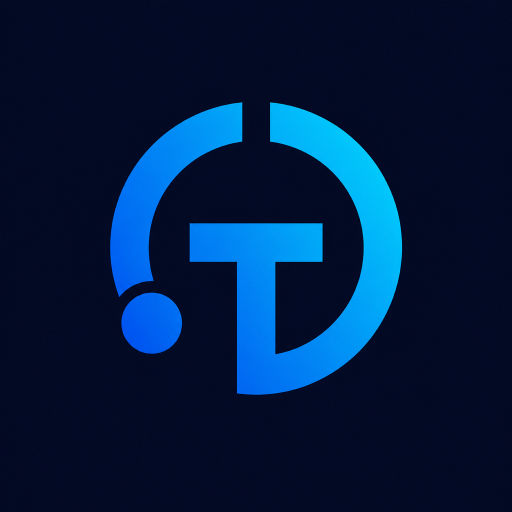

<p align="right">
   <strong>EN</strong> | <a href="./README.zh-CN.md">简体中文</a>
</p>
<div align="center">
    
    <h1>计然 · Jiran</h1>
</div>

<p align="center">
    <em>Local-first token, cost and quota monitoring for the AI coding tools you already run.</em>
</p>

<p align="center">
    <a href="https://github.com/IGNGserver/jiran/releases"></a>
    <a href="https://github.com/IGNGserver/jiran/releases"></a>
    
    
    
    
    <a href="LICENSE"></a>
</p>

## Why this name

计然 (Jīrán) is the strategist in《史记·货殖列传》credited with counting both what a state
burned and what it earned. That is the whole product in two words: the tokens your AI tools
spent, and what those plans actually cost you. The project shipped as **Token Monitor** up to
v0.47.0-rev.36; [the rename section](#renamed-from-token-monitor) covers what moved and what
deliberately did not.

## What it answers

Two questions cover most of an AI coding setup, and Jiran reads both from where the data
already lives — your own disk:

- **How much have I used?** Every tracked tool keeps transcripts, session databases or caches
  locally. Jiran turns those into tokens and cost, broken down by tool, model, device, project
  and individual session, and keeps a durable daily history of it.
- **How much of my plan is left?** Per-provider quota windows — session, weekly, billing,
  credits. Quota probing belongs to the Hub: it refreshes the accounts configured there and
  publishes one sanitized snapshot to every connected device. A device running in local-only
  mode therefore has no quota source, and its Limits page is empty by design.
- **What am I paying for it?** A hand-kept subscription ledger sits beside the model price
  list, so a plan's tooltip can report what it costs, when it renews, and what this month's
  usage would have cost at API prices.

## Four surfaces, one product

| Surface | Role | Needs a Hub |
|---|---|:---:|
| **Desktop app** — Electron on Windows, macOS and Linux | collects this machine and shows the full UI | no |
| **Hub** — Docker Compose + MySQL | ingest, aggregation, SSE, and the same dashboard as a web app / installable PWA | — |
| **Headless agent** — `src/agent` | the collector with no GUI, for servers and WSL distros | yes |
| **Android client** — Kotlin / Compose | reads the fleet and the quotas on a phone; it collects nothing and posts nothing | yes |

The desktop app and the Hub dashboard render the *same* interface from `src/shared-ui/`, so a
screen you arranged once behaves the same in both. The only call each host makes differently —
how data reaches the view — sits behind one transport module (`httpTransport` for the Hub,
`ipcTransport` for Electron), and a guard test keeps every other host-specific call out of the
shared views.

Inside the app there are six destinations: **Overview** (today at a glance), **Usage** (the
period tabs and every breakdown), **Devices**, **Limits**, **Trends** (heatmap, streaks,
stacked per-tool / per-model history), and **Management** — one page holding provider accounts,
the subscription and pricing ledger, and the dashboard preferences.

## Honest about what is measured

A usage dashboard that quietly mixes measurements with guesses is worse than no dashboard.
These rules are what the product commits to, and they hold on every surface:

- **`~` means estimated.** Where a tool never stored real token counts, the total is estimated
  from the text it did store and is shown with a leading `~`; the basis of each estimate is
  documented in the matrix notes.
- **Credits are their own unit.** A provider that bills in credits (Qoder is the case in point)
  reports exact credits beside `~`-marked tokens; credits are never folded into a token total.
- **A refresh never interrupts you.** Frames arrive every few seconds; the renderer defers a
  rebuild while a dropdown or a half-typed value is open, keeps expanded rows and scroll
  positions, and skips the DOM write entirely when nothing changed.
- **A number belongs to the tab that measured it.** Day / Month / Total come from the
  collector's fixed windows; Yesterday and Week are calendar ranges resolved on request, and
  each of them is only ever rendered by the tab that asked for it. The week starts on ISO
  Monday everywhere a total is reported.
- **A greyed device is a silent device.** A device whose last report is older than 10 minutes
  is marked stale on purpose rather than being shown as if it were live.

## Supported tools

| Capability | Coverage |
|---|---:|
| Rows in the matrix (tools + providers) | 59 |
| Tools reporting token usage | 52 |
| Providers with quota windows | 26 |
| Tools with per-session detail | 5 |

The full matrix — every tool, the exact path it is read from, and which of the three
capabilities it supports — lives in **[docs/supported-tools.md](docs/supported-tools.md)**.
A tool with no row is not tracked: the client list is wired in one place
(`TRACKED_CLIENTS`) and every runtime always collects all of it, so there is no per-tool
opt-in that could silently under-count.

## Install

Grab the current build from [GitHub Releases](https://github.com/IGNGserver/jiran/releases):

| Platform | Artifact |
|---|---|
| macOS (Apple Silicon / Intel) | `Jiran-<version>-arm64.dmg`, `Jiran-<version>-x64.dmg` — signed and notarized |
| Windows 10/11 | `Jiran-Setup-<version>.exe` (installer) or `Jiran-<version>.exe` (portable) — [code-signed](docs/code-signing.md) |
| Linux x64 | `Jiran-<version>.AppImage` or `Jiran-<version>.deb` |
| Android | `Jiran-Android-<version>.apk` — a Hub read client |
| Headless / server | `Jiran-Headless-<version>.tar.gz` — Node.js 22.13+, then `npm ci --omit=dev` |

On Linux, the APT repository keeps the app upgraded through the package manager. Verify the key
fingerprint against `jiran-archive-keyring-fingerprint.txt` published beside it:

```bash
curl -fsSL https://igngserver.github.io/jiran/apt/jiran-archive-keyring.asc \
  | gpg --dearmor \
  | sudo tee /usr/share/keyrings/jiran-archive-keyring.gpg >/dev/null
curl -fsSL https://igngserver.github.io/jiran/apt/jiran.sources \
  | sudo tee /etc/apt/sources.list.d/jiran.sources >/dev/null
sudo apt update && sudo apt install jiran
```

Packaged builds check GitHub Releases and surface an update indicator; where the platform supports
self-install, Management's **Behaviour** group offers **Check for updates** and **Restart to
install**. The channel follows the **installed** build: a formal release (`1.2.3`) only considers
non-prerelease publishes, while a `-rev.N` build tracks the newest publish.

**First run needs no setup.** Local mode is the default: launch the app and it starts tracking
this device — no Hub, no agent, no `.env`.

## Run a Hub for several machines

The Hub is a single-user component: you run it on a machine you control, and every device that
should share its usage points at it. The root `docker-compose.yml` is the **only** supported
deployment — there is no embedded Hub, no standalone Hub command and no secondary edge
deployment.

```bash
cp .env.example .env
# set JIRAN_SECRET plus the MySQL passwords, then:
docker compose up -d
curl http://127.0.0.1:17321/api/health
```

The dashboard is served by the Hub itself on the same port (`http://<server>:17321`) and can be
installed as a PWA. The image is `ghcr.io/igngserver/jiran-hub`; pin a version with
`JIRAN_VERSION` for anything you care about. Full guide: [docs/hub-compose.md](docs/hub-compose.md).

Then, on each machine:

- **Desktop app** → Management → Hub connection → **Connect to a hub**, paste the URL and the
  same Hub key. The app keeps collecting locally and uploads its own summary.
- **Headless agent** → configure the same URL and key and run `npm run agent` (or
  `npm run agent:once` from cron / launchd); see the [headless agent guide](docs/headless-agent.md).
  Use it on machines with no GUI, and inside a WSL distro when the tool there keeps its usage in
  SQLite, which the Windows-side scan cannot read
  ([docs/wsl-sqlite-setup.md](docs/wsl-sqlite-setup.md)).
- **Android** → point the app at the Hub URL and the same key. Release builds require HTTPS.

`JIRAN_SECRET` is the one owner key: it covers reads, ingest and administration, including the
quota accounts. Devices identify *data sources*, not users. Remote connections require HTTPS;
plain HTTP to a Hub on your LAN is possible only after you opt in explicitly, and an older
profile pointing at a non-loopback `http://` Hub keeps its local collection while its Hub
channels stay blocked until you choose.

## How the data moves

```text
one device                                   the Hub
──────────                                   ───────
AI tools write local        tokscale         POST /api/ingest      MySQL
transcripts / session  ──▶  collector  ──────────────────────▶  normalize + aggregate
databases / caches          (src/shared)                              │
      ▲   watch for changes                                           │ SSE /api/stats/stream
      └── every few seconds ──────────────────────────────────────────┴▶ desktop · browser · Android
```

- `src/shared/collector.js` is the only place that invokes `tokscale`; it funnels the output
  through one defensive parser, so an upstream format change degrades loudly instead of
  silently reporting zero.
- Local collection is watch-driven (a 1.5 s debounce after a file changes) with a full period
  scan every 5 minutes. Period scans run serially on purpose: they are CPU- and IO-bound, and
  running three at once only slows the machine you are coding on.
- On Windows, file-based usage from **running** WSL distros is scanned and merged into that
  machine's totals on full ticks. A distro is never started to satisfy a scan, and the scan is
  gated on the registry, so a machine without WSL never spawns `wsl.exe`.
- Usage and quotas are separate pipelines with different owners. Collection runs on the device;
  quota probing runs on the Hub, which keeps each account's last good result, retries with
  backoff, and pushes one normalized snapshot to every client. Configuring an account on the Hub
  never touches collection on any device, and no device uploads provider credentials.
- Reads are staged and compressed because one client is a phone on a mobile network:
  `/api/stats/summary` is the first-paint projection of the same aggregate, and the SSE stream
  can start `detail=slim`. A projection is never a second measurement — the headline numbers
  stay identical to `/api/stats`.
- What a synchronized device contributes per session is a usage row — tokens, cost, models, an
  optional workspace label; absolute workspace paths stay on the collecting device. The
  per-prompt breakdown is read live from that tool's own files on the machine that has them, and
  prompt text, replies and source code never leave it.

## Privacy

Local-first is the actual architecture, not a slogan: prompts, responses, source code and file
contents stay on your machine, and nothing is sent to the project maintainer — there is no
telemetry, no analytics and no hosted backend. Network access happens only for documented or
user-enabled features: the update check, the exchange-rate lookup, the Hub you deploy, and the
provider endpoints for quotas you configured. Quota accounts are configured on the Hub and probed
there — the only raw credential the desktop app stores is the Hub key.
Details: [docs/privacy.md](docs/privacy.md).

## Configuration

- **Desktop app** — preferences live in the OS user-data directory (`settings.json`, plus a
  permission-restricted `credentials.json` that holds the one raw credential the GUI manages:
  the Hub key). Management's
  **Display** group covers language, window surface and motion; **Behaviour** covers launch at
  login, start hidden, closing to the tray and updates; **Hub connection** switches the device
  between local-only and a Hub. What gets *collected* is not configurable: the tracked set,
  cadence, history and session archive are fixed by `src/shared/collectorConfig.js`.
- **Agent and Hub** — a `.env` file at the project root (copy `.env.example`), with precedence
  CLI flag → environment variable → built-in default. `JIRAN_*` is the documented prefix; the
  historical `TOKEN_MONITOR_*` names keep working, and one of those still wins when both are set.

Every setting and environment variable: [docs/configuration.md](docs/configuration.md). The HTTP
contract between devices and the Hub: [docs/API.md](docs/API.md). The interface itself is localized
into English, Simplified and Traditional Chinese, Japanese and Korean; these two READMEs are the
documentation surface, and the tool matrix is English-only.

## Tested platforms

Development and verification concentrate on Windows 11 (primary), a Docker Compose Hub, and
Ubuntu running the headless agent's ingest path. **Anything outside that has not been fully
verified and may misbehave** — macOS packaging in particular requires a real Developer ID
signing identity to build.

## Development

```bash
npm install
npm start                  # the desktop app
npm run agent:once         # one collect + post cycle, no GUI
npm run verify             # guards + lint + tests — this is what CI runs
npm test                   # node:test suite
npm run test:mysql         # Hub tests against MySQL
npm run verify:deb         # Debian package check
```

Needs Node.js 22.13+. The Android client is a separate Gradle project:
`cd android && ./gradlew :app:testDebugUnitTest` / `:app:assembleDebug`.

[AGENTS.md](AGENTS.md) is the authoritative architecture and conventions document — it is
written for coding agents and doubles as the contributor guide. [docs/design/](docs/design/)
holds the UI contracts.

## Renamed from Token Monitor

v0.47.0-rev.37 renamed the product to 计然 / Jiran. It is a rename, not a reset:

- The desktop app copies the legacy `Token Monitor` user-data folder into `Jiran` on first launch,
  and the shared runtime state (device identity, `agent.pid`, the daily and session archives, the
  tokscale cache) merges forward too. A target file is never overwritten and the legacy directory
  is never deleted: a still-running pre-rename desktop or agent keeps writing there, and the PID
  check reads both locations.
- `TOKEN_MONITOR_*` environment variables and the `X-Token-Monitor-Secret` header keep working
  beside the new `JIRAN_*` / `X-Jiran-Secret` spellings.
- Releases push identical tags to both `ghcr.io/igngserver/jiran-hub` and
  `ghcr.io/igngserver/token-monitor-hub` during the transition.
- APT publishes `jiran` and a `token-monitor` transitional package that depends on it, so
  `apt upgrade` carries existing installs over. **One manual step is still required**: GitHub
  Pages URLs do not follow a repository rename, so a source file pointing at
  `…/token-monitor-suite/apt` now 404s — re-run the `curl … | sudo tee` line above once.
- Deliberately unchanged, because they are identity surfaces: the Electron `appId`
  (`com.igng.tokenmonitor`), the Android `applicationId`, the MySQL default database and user,
  and the code-signing project slug.

## Acknowledgments

- [tokscale](https://github.com/junhoyeo/tokscale) — the log parser and token accounting this
  project runs on.
- [CodexBar](https://github.com/steipete/CodexBar) — early research on reading AI plan quotas.
- [token-monitor](https://github.com/Javis603/token-monitor) by [@Javis](https://github.com/Javis603)
  — the upstream project this one started from, for its desktop architecture.
- Free code signing via [SignPath.io](https://signpath.io/), certificate by
  [SignPath Foundation](https://signpath.org/) — see [docs/code-signing.md](docs/code-signing.md).

## License

[MIT](LICENSE) © [IGNGserver](https://github.com/IGNGserver) & [@Javis](https://github.com/Javis603)
