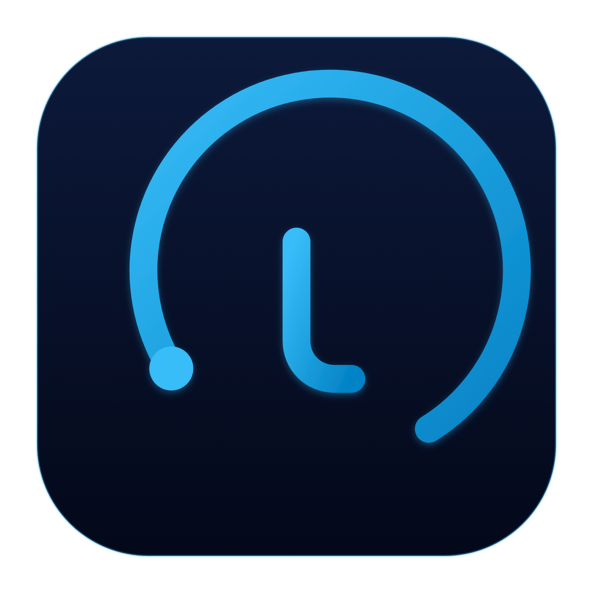

<p align="right">
   <a href="./README.md">English</a> | <strong>简体中文</strong>
</p>
<div align="center">
    
    <h1>计然</h1>
</div>

<p align="center">
    <em>把你已经在用的 AI 编程工具的 Token 用量、花费与订阅额度，先在本机算清楚。</em>
</p>

<p align="center">
    <a href="https://github.com/IGNGserver/jiran/releases"></a>
    <a href="https://github.com/IGNGserver/jiran/releases"></a>
    
    
    
    
    <a href="LICENSE"></a>
</p>

## 为什么叫「计然」

计然是《史记·货殖列传》里那位善于「计」的谋士——既算支出，也算收入。这个名字就是本项目的
全部范围：AI 工具烧掉了多少 Token，这些订阅与调用实际花了你多少钱。项目在 v0.47.0-rev.36 之前
叫 **Token Monitor**，改名的影响面见[改名说明](#从-token-monitor-改名)。

## 它回答什么问题

AI 编程环境通常只有两个数字说不清，计然都从数据所在的地方——你自己的磁盘——把它们读出来：

- **我到底用了多少？** 每个被跟踪的工具都在本机留下 transcript、会话数据库或缓存。计然把它们
  换算成 Token 与成本，可按工具、模型、设备、项目、单个会话拆分，并且长期保存每日历史。
- **我的订阅还剩多少？** 各供应商的额度窗口（会话 / 周 / 账期 / credits）。额度探测归 Hub：它刷新
  配置在那里的账号，并把一份脱敏后的快照推给所有连接的设备。因此纯本机模式的设备没有额度来源，
  「额度」页为空是设计如此。
- **我为此付了多少钱？** 手工记账的订阅台账与模型价格表放在一起，于是套餐标签的悬浮提示能告诉
  你：这个套餐多少钱、下次续费是什么时候、本月用量按 API 价格本应花多少。

## 四个界面，一个产品

| 界面 | 职责 | 是否需要 Hub |
|---|---|:---:|
| **桌面应用** — Electron，支持 Windows / macOS / Linux | 采集本机数据并呈现完整界面 | 否 |
| **Hub** — Docker Compose + MySQL | 接收上报、聚合、SSE 推送，并用同端口提供 Web 仪表板 / 可安装 PWA | — |
| **Headless agent** — `src/agent` | 没有图形界面的采集端，用于服务器与 WSL 发行版 | 是 |
| **Android 客户端** — Kotlin / Compose | 在手机上查看设备群组的用量与额度；不采集、不上报 | 是 |

桌面应用与 Hub 网页渲染的是**同一套**界面（`src/shared-ui/`），一次排布的页面在两处行为一致。
两者唯一的差别是数据怎么到达视图，这一层收在 transport 模块里（Hub 用 `httpTransport`，Electron
用 `ipcTransport`），并有守卫测试禁止共享视图直接碰 `fetch`、存储或宿主 API。

应用内共六个入口：**总览**（今日一览）、**使用情况**（时间范围与各种拆分）、**设备**、**额度**、
**趋势**（热力图、连续天数、按工具/模型堆叠的历史）、**管理**——账号、订阅与定价、界面偏好统一
收在一页里。

## 数字怎么来的，说清楚

一个把「实测」和「估算」混着显示的仪表板，比没有仪表板更糟。以下是每个界面都遵守的规则：

- **`~` 就是估算。** 某个工具从来没存过真实 Token 数时，总量按它存下的文本估算得出，并在数字
  前加 `~`；每一项估算的依据都写在支持矩阵的注释里。
- **credits 是独立单位。** 以 credits 计费的供应商（Qoder 就是这样）会给出精确 credits，旁边的
  Token 与成本仍标 `~`；credits 绝不折算进 Token 总量。
- **刷新不打断操作。** 数据每几秒就来一帧；下拉框开着、输入到一半时重绘会被推迟，展开的行与
  滚动位置都保留，内容没变则完全不碰 DOM。
- **数字只属于问它的那个标签页。** 今天 / 本月 / 全部来自采集器的固定窗口，昨日与本周是按需
  解析的日历区间，且只有发起请求的那个标签页会消费结果；凡是上报总量的地方，一周都从 ISO 周一
  开始。
- **置灰的设备是真的沉默了。** 最后一次上报超过 10 分钟的设备被标记为 stale 并置灰，而不是假装
  它还在线。

## 支持哪些工具

| 能力 | 数量 |
|---|---:|
| 支持矩阵条目（工具 + 供应商） | 59 |
| 可统计 Token 用量的工具 | 52 |
| 可读取订阅额度的供应商 | 26 |
| 可展开会话明细的工具 | 5 |

完整矩阵——每个工具的确切读取路径、三项能力各自支持到哪一步——在
**[docs/supported-tools.md](docs/supported-tools.md)**（英文）。工具清单只在一处定义
（`src/shared/clientTracking.js` 的 `TRACKED_CLIENTS`），所有运行时常驻采集全集，没有逐项开关，
因此不存在「悄悄少算」的状态。

## 安装

从 [GitHub Releases](https://github.com/IGNGserver/jiran/releases) 下载当前版本：

| 平台 | 文件 |
|---|---|
| macOS（Apple Silicon / Intel） | `Jiran-<version>-arm64.dmg`、`Jiran-<version>-x64.dmg`，已签名并公证 |
| Windows 10/11 | `Jiran-Setup-<version>.exe`（安装版）或 `Jiran-<version>.exe`（便携版），已[代码签名](docs/code-signing.md) |
| Linux x64 | `Jiran-<version>.AppImage` 或 `Jiran-<version>.deb` |
| Android | `Jiran-Android-<version>.apk`（Hub 的读端） |
| 无界面 / 服务器 | `Jiran-Headless-<version>.tar.gz`，需 Node.js 22.13+，装好依赖用 `npm ci --omit=dev` |

Linux 上可以挂 APT 仓库，让包管理器负责升级。请先与同目录下的
`jiran-archive-keyring-fingerprint.txt` 核对密钥指纹：

```bash
curl -fsSL https://igngserver.github.io/jiran/apt/jiran-archive-keyring.asc \
  | gpg --dearmor \
  | sudo tee /usr/share/keyrings/jiran-archive-keyring.gpg >/dev/null
curl -fsSL https://igngserver.github.io/jiran/apt/jiran.sources \
  | sudo tee /etc/apt/sources.list.d/jiran.sources >/dev/null
sudo apt update && sudo apt install jiran
```

打包版会自动检查 GitHub Releases 并给出更新提示；在平台支持自装的前提下，管理页的「行为」组里
提供「检查更新」与「重启安装」。更新通道跟随**已安装**的版本：正式版（`1.2.3`）只考虑非
prerelease 的发布，带 `-rev.N` 的构建则跟随最新发布。

**首次运行不需要任何配置。** 默认就是本机模式：打开应用即开始跟踪这台设备，不需要 Hub、不需要
agent、也不需要 `.env`。

## 多台机器：部署一个 Hub

Hub 是单用户组件——跑在你自己控制的机器上，需要共享用量的设备都指向它。根目录的
`docker-compose.yml` 是**唯一**受支持的部署方式：没有内嵌 Hub，没有独立的 Hub 命令，也没有第二套
边缘部署。

```bash
cp .env.example .env
# 填好 JIRAN_SECRET 与 MySQL 口令，然后：
docker compose up -d
curl http://127.0.0.1:17321/api/health
```

网页仪表板由 Hub 自己在同一端口提供（`http://<server>:17321`），可以安装为 PWA。镜像是
`ghcr.io/igngserver/jiran-hub`，生产环境请用 `JIRAN_VERSION` 固定版本。完整说明：
[docs/hub-compose.md](docs/hub-compose.md)。

然后在每台机器上：

- **桌面应用** → 管理 → 中枢连接 → **连接中枢**，填入地址与同一个 Hub 密钥。采集仍在本地进行，
  只把本机的汇总上报。
- **Headless agent** → 配置同样的地址与密钥，运行 `npm run agent`（或由 cron / launchd 跑
  `npm run agent:once`），见 [headless agent 指南](docs/headless-agent.md)。没有图形界面的机器用它；
  当 WSL 里的工具把用量存在 SQLite 时也用它——Windows 侧的扫描读不到那种库
  （见 [docs/wsl-sqlite-setup.zh-CN.md](docs/wsl-sqlite-setup.zh-CN.md)）。
- **Android** → 填入 Hub 地址与同一个密钥。正式版只接受 HTTPS。

`JIRAN_SECRET` 是唯一的所有者密钥：读取、上报与管理（包括额度账号）都用它。设备标识的是**数据
来源**，不是用户。远程连接要求 HTTPS；只有你显式开启可信局域网选项后，桌面端/agent 才允许明文
HTTP。旧配置若指向非回环地址的 `http://` Hub，升级时不会被悄悄降级：本机采集照常，Hub 的读取、
上报与推送通道保持阻断，直到你做出选择。

## 数据是怎么流动的

```text
一台设备                                      Hub
────────                                      ────
AI 工具在本机写          tokscale              POST /api/ingest     MySQL
transcript / 会话  ──▶  采集器  ──────────────────────────▶  归一化 + 聚合
数据库 / 缓存           （src/shared）                             │
      ▲   监听文件变化                                              │ SSE /api/stats/stream
      └── 每几秒一帧 ──────────────────────────────────────────────┴▶ 桌面 · 浏览器 · Android
```

- `src/shared/collector.js` 是唯一调用 `tokscale` 的地方；输出统一经过一个防御式解析器，因此上游
  格式变化会明显退化，而不是安静地报出 0。
- 本机采集由文件监听驱动（变化后 1.5 秒去抖），每 5 分钟做一次完整的周期扫描。周期扫描刻意串行
  ——它们吃 CPU 与 IO，并发三跑只会拖慢你正在写代码的机器。
- Windows 上会把**正在运行**的 WSL 发行版里的文件型用量一并扫出，并在全量扫描时并入这台机器的
  总量；不会为了扫描去启动一个已停止的发行版，且整个能力以注册表为开关——没装 WSL 的机器连
  `wsl.exe` 都不会被调用。
- 用量与额度是两条各有归属的链路。采集在设备上跑；额度探测在 Hub 上跑——Hub 为每个账号保留最近
  一次成功的结果，按退避策略重试，再把一份归一化快照推给所有客户端。在 Hub 上配置账号不会影响任何
  设备的采集，设备也不会上传服务商凭据。
- 读取是分阶段且压缩的，因为总有一台客户端是走移动网络的手机：`/api/stats/summary` 是同一份聚合
  的首屏投影，SSE 也可以 `detail=slim` 起流。投影绝不是第二次测量——头条数字必须与 `/api/stats`
  完全一致。
- 同步上传的会话信息只是每个会话的用量条目（Token、成本、模型、可选的工作区标签），绝对路径留在
  采集的那台机器上。逐条 prompt 的展开只在真正持有该会话的机器上现场读本地文件；prompt 正文、
  回复与源码不出本机。

## 隐私

本机优先是架构事实，不是口号：prompt、回复、源码与文件内容都留在本机，任何数据都不会发给项目
维护者——没有遥测、没有埋点、没有托管后端。网络请求只发生在有文档说明或由你开启的功能上：检查
更新、拉取汇率、你部署的 Hub，以及你配置的额度账号对应的服务商接口。额度账号配置在 Hub 上，也由
Hub 去探测——桌面应用保存的唯一原始凭据就是那个 Hub 密钥。细节见 [docs/privacy.md](docs/privacy.md)。

## 配置

- **桌面应用** — 偏好存在操作系统的 user-data 目录里（`settings.json`，以及权限受限的
  `credentials.json`——GUI 管理的唯一原始凭据 Hub 密钥就存在这里）。管理页的「显示」组管语言、
  窗口表面与动效；「行为」组管登录自启、隐藏启动、关闭进托盘与更新；「中枢连接」组决定这台设备
  是本机模式还是连到 Hub。至于
  「采集什么」并不在配置范围内：跟踪集合、节奏、历史与会话归档由 `src/shared/collectorConfig.js`
  固定。
- **agent 与 Hub** — 项目根目录的 `.env`（从 `.env.example` 复制），优先级为 CLI 参数 → 环境变量
  → 内置默认值。`JIRAN_*` 是当前文档化的前缀，历史 `TOKEN_MONITOR_*` 名称继续有效，两者同时存在时
  以旧名为准。

所有设置与环境变量：[docs/configuration.md](docs/configuration.md)。设备与 Hub 之间的 HTTP 契约：
[docs/API.md](docs/API.md)。界面本身提供英文、简体中文、繁体中文、日语、韩语五种语言；文档面只有
本文件与英文版两份，工具矩阵为英文。

## 实测平台

开发与验证集中在 Windows 11（主力）、Docker Compose Hub，以及 Ubuntu 上 headless agent 的上报
链路。**清单之外的平台与环境未经完整验证，可能遇到意料之外的问题。** macOS 的发行打包尤其需要
真实的 Developer ID 签名身份才能完成。

## 开发

```bash
npm install
npm start                  # 桌面应用
npm run agent:once         # 跑一轮采集 + 上报后退出
npm run verify             # 守卫 + lint + 测试，CI 跑的就是它
npm test                   # node:test 测试集
npm run test:mysql         # 需要 MySQL 的 Hub 测试
npm run verify:deb         # Debian 包校验
```

工具链需要 Node.js 22.13+。Android 是独立的 Gradle 工程：
`cd android && ./gradlew :app:testDebugUnitTest` / `:app:assembleDebug`。

[AGENTS.md](AGENTS.md) 是架构与约定的权威文档——它写给编码 Agent，同时充当贡献指南。界面契约在
[docs/design/](docs/design/)。

## 从 Token Monitor 改名

v0.47.0-rev.37 把产品改名为 计然 / Jiran。这是改名，不是重来：

- 桌面应用首次启动会把旧的 `Token Monitor` user-data 目录复制到 `Jiran`，共享运行态（设备标识、
  `agent.pid`、每日与会话归档、tokscale 缓存）也一并向前合并。目标文件永不被覆盖，旧目录也永不
  删除：仍在运行的改名前 desktop/agent 会继续往旧目录写，PID 检查会同时读两处。
- `TOKEN_MONITOR_*` 环境变量与 `X-Token-Monitor-Secret` 请求头继续可用，与新的 `JIRAN_*` /
  `X-Jiran-Secret` 并行。
- 过渡期内，发布同时向 `ghcr.io/igngserver/jiran-hub` 与 `ghcr.io/igngserver/token-monitor-hub`
  推送完全相同的标签。
- APT 同时发布 `jiran` 与依赖它的 `token-monitor` 过渡包，已装机器 `apt upgrade` 就会被带到新包名。
  **但仍需一次手工操作**：GitHub Pages 的 URL 不随仓库改名重定向，指向
  `…/token-monitor-suite/apt` 的源文件现在会 404，请重跑上面那条 `curl … | sudo tee`。
- 有意保留不动的是身份类标识：Electron `appId`（`com.igng.tokenmonitor`）、Android
  `applicationId`、MySQL 默认库名与用户名、签名项目的 slug。

## 致谢

- [tokscale](https://github.com/junhoyeo/tokscale) —— 本项目依赖的日志解析与 Token 计量。
- [CodexBar](https://github.com/steipete/CodexBar) —— 早期关于读取 AI 订阅额度的研究。
- [token-monitor](https://github.com/Javis603/token-monitor)（[@Javis](https://github.com/Javis603)）
  —— 本项目由此派生，感谢其桌面端架构。
- 免费的代码签名由 [SignPath.io](https://signpath.io/) 提供，证书来自
  [SignPath Foundation](https://signpath.org/)，见 [docs/code-signing.md](docs/code-signing.md)。

## 许可证

[MIT](LICENSE) © [IGNGserver](https://github.com/IGNGserver) 与 [@Javis](https://github.com/Javis603)
